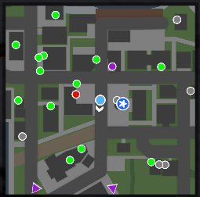
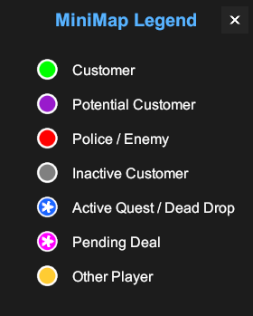

# Schedule I MiniMap

A minimap mod for Schedule I, built for [MelonLoader](https://melonwiki.xyz/).

  
   
  

## Features

- A complete minimap revealing the position of:
    - Yourself
    - Unlocked customers
    - Potential customers
    - Other players
    - NPCs
    - Objectives
- Reposition, Zoom, and change the orientation of the map.

## Installation

1.  Install [MelonLoader](https://melonwiki.xyz/#/?id=installation) for Schedule I.
2.  Navigate to your Schedule I installation directory (usually `C:\Program Files (x86)\Steam\steamapps\common\Schedule I`).
3.  Place the `MiniMap.dll` file into the `Mods` folder.
4.  Launch the game.

## Controls

| Action | Control |
| :--- | :--- |
| **Toggle Minimap** | `F10` |
| **Zoom In** | `Scroll Up` / `Page Up` / UI Button |
| **Zoom Out** | `Scroll Down` / `Page Down` / UI Button |
| **Move Minimap** | `Left Click + Drag` (Title Bar) |
| **Toggle Legend** | UI Legend Button (`?`) |
| **Toggle Orientation** | UI Orientation Button |

## Contributing

Contributions are welcome! Feel free to open issues for bugs or feature requests, or submit pull requests for improvements.

## License

This project is licensed under the MIT License - see the [LICENSE.txt](LICENSE.txt) file for details.

## Acknowledgments
- Thanks to the **MelonLoader** team for the modding framework.
- Thanks to **TVGS** for creating Schedule I.
